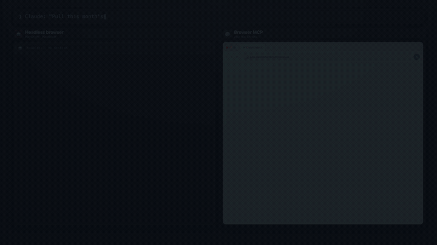

# Browser MCP by Agent360

[](https://www.npmjs.com/package/@agent360/browser-mcp)
[](https://www.npmjs.com/package/@agent360/browser-mcp)
[](https://github.com/Agent360dk/browser-mcp)
[](https://opensource.org/licenses/MIT)
[](https://modelcontextprotocol.io)

**Control your real Chrome from Claude Code — with your logins, cookies, and 2FA.**



The only browser MCP with **multi-session support** (10 concurrent AI sessions), **human-in-the-loop** (2FA, CAPTCHA, credentials), and **built-in provider integrations** (Stripe, HubSpot, Slack, and 6 more). 29 tools total.

## Install — 2 steps (~60 seconds)

### Step 1: Configure the MCP server

```bash
npx @agent360/browser-mcp install
```

This copies the Chrome extension files to `~/.browser-mcp/extension/` and adds the MCP server to your Claude Code config. **You'll see the path to the extension folder printed in the terminal — copy it.**

### Step 2: Load the extension in Chrome

> Chrome won't let extensions install themselves from npm — you have to load it manually one time. After that, it auto-updates whenever you re-run the install command.

1. **Open Chrome** and type `chrome://extensions` in the address bar
2. **Toggle "Developer mode"** ON (top right corner)
3. **Click "Load unpacked"** (top left, next to "Pack extension")
4. **Navigate to `~/.browser-mcp/extension/`** and click "Select"
   - On Mac: Press `Cmd+Shift+G` in the file picker, paste `~/.browser-mcp/extension/`, press Enter
   - On Windows: Paste `%USERPROFILE%\.browser-mcp\extension\` in the address bar
   - On Linux: Type `~/.browser-mcp/extension/` in the path field
5. **Restart Claude Code** so it picks up the new MCP server

That's it. The Browser MCP icon will appear in your toolbar, and 29 browser tools are now available in Claude Code.

### Alternative: Manual zip download (no npm)

If you don't want to use npm, download the extension directly:

1. [Download `browser-mcp-v1.16.1.zip`](https://github.com/Agent360dk/browser-mcp/releases/latest) from the latest GitHub release
2. Unzip the file (anywhere — e.g. `~/Downloads/browser-mcp-extension/`)
3. Follow Step 2 above, but select the unzipped folder instead of `~/.browser-mcp/extension/`
4. Configure Claude Code manually by adding this to your `~/.claude.json` (or run `npx @agent360/browser-mcp install --skip-extension`):
   ```json
   {
     "mcpServers": {
       "browser-mcp": {
         "command": "npx",
         "args": ["@agent360/browser-mcp"]
       }
     }
   }
   ```

### Coming soon: Chrome Web Store

We've submitted Browser MCP to the Chrome Web Store for review. Once approved, you'll be able to install with one click and skip the "Developer mode" step entirely. Watch for updates on [browsermcp.dev](https://browsermcp.dev).

## Why This Over Playwright MCP / BrowserMCP?

| | Browser MCP | Playwright MCP | BrowserMCP.io |
|---|---|---|---|
| **Browser** | Your real Chrome | Headless (new session) | Your real Chrome |
| **Logins/cookies** | Already authenticated | Must log in every time | Already authenticated |
| **Multi-session** | 10 concurrent sessions with color-coded tab groups | Single session | Single session |
| **Human-in-the-loop** | `browser_ask_user` — 2FA, CAPTCHA, credential input | None | None |
| **Provider integrations** | 9 built-in (Stripe, HubSpot, Slack...) | None | None |
| **CORS bypass** | `browser_fetch` from extension background | N/A | Limited |
| **Network monitoring** | `browser_wait_for_network` via CDP | Built-in | None |
| **CSP-strict sites** | Chrome Debugger API throughout | Works (headless) | Limited |
| **Custom dropdowns** | Angular Material, React Select support | Works (headless) | Limited |
| **Install** | `npx @agent360/browser-mcp install` | `npx @anthropic-ai/mcp-playwright` | Manual clone |

## 29 Tools

### Navigation & Content
| Tool | Description |
|------|-------------|
| `browser_navigate` | Navigate to URL (reuses tab, or `new_tab=true`) |
| `browser_get_page_content` | Get page text or HTML |
| `browser_screenshot` | Screenshot via Chrome Debugger (works even when tab isn't focused) |
| `browser_execute_script` | Run JavaScript in page context |

### Interaction
| Tool | Description |
|------|-------------|
| `browser_click` | Click via CSS or text selector (`text=Submit`, `button:text(Next)`) |
| `browser_fill` | Fill input fields (works on CSP-strict sites) |
| `browser_press_key` | Keyboard events (Enter, Tab, Escape, modifiers) |
| `browser_scroll` | Scroll to element or by pixels |
| `browser_wait` | Wait for element to appear |
| `browser_hover` | Hover for tooltips/dropdowns |
| `browser_select_option` | Native `<select>` + custom dropdowns (Angular Material, React Select) |
| `browser_handle_dialog` | Accept/dismiss alert/confirm/prompt dialogs |

### Tabs & Frames
| Tool | Description |
|------|-------------|
| `browser_list_tabs` | List session's tabs only |
| `browser_switch_tab` | Switch to tab by ID |
| `browser_close_tab` | Close tab (session-owned only) |
| `browser_get_new_tab` | Get most recently opened tab (OAuth popups) |
| `browser_list_frames` | List iframes on page |
| `browser_select_frame` | Execute JS in specific iframe |

### Data & Network
| Tool | Description |
|------|-------------|
| `browser_get_cookies` | Get cookies for domain |
| `browser_get_local_storage` | Read localStorage |
| `browser_fetch` | HTTP request from extension (bypasses CORS) |
| `browser_wait_for_network` | Wait for specific API call to complete |
| `browser_extract_token` | Navigate to provider dashboard + extract API token |

### CAPTCHA Solving
| Tool | Description |
|------|-------------|
| `browser_solve_captcha` | Detect and solve CAPTCHAs. Auto-detects reCAPTCHA v2/v3, hCaptcha, Turnstile, FunCaptcha. Actions: `detect`, `click_checkbox` (auto-click, ~80% pass with Google login), `click_grid` (AI vision guided), `ask_human` (fallback) |

### Human-in-the-Loop
| Tool | Description |
|------|-------------|
| `browser_ask_user` | Show overlay dialog for 2FA, CAPTCHA, credentials, or any user input |

### Data
| Tool | Description |
|------|-------------|
| `browser_get_cookies` | Get cookies for a domain |
| `browser_set_cookies` | Set cookies for a domain |
| `browser_get_local_storage` | Read localStorage from page |
| `browser_set_local_storage` | Write localStorage values |
| `browser_console_logs` | Capture console.log/warn/error messages from page |
| `browser_upload_file` | Upload files to `<input type="file">` via Chrome Debugger API (no dialog) |

## Multi-Session Support

Each Claude Code conversation gets its own MCP server on a unique port (9876-9885). The Chrome extension connects to all active servers simultaneously.

```
Claude Session 1 ←(stdio)→ MCP :9876 ←(WS)→
Claude Session 2 ←(stdio)→ MCP :9877 ←(WS)→  Chrome Extension → Browser
Claude Session 3 ←(stdio)→ MCP :9878 ←(WS)→
```

- **Session isolation** — each session gets a color-coded Chrome Tab Group
- **Tab ownership** — sessions can only see and control their own tabs
- **Auto-cleanup** — processes exit when Claude Code closes the conversation

## Built-in Provider Integrations

`browser_extract_token` navigates to the provider's API settings page and guides token extraction:

| Provider | Token Format | Dashboard |
|----------|-------------|-----------|
| Stripe | `sk_test_...` / `sk_live_...` | stripe.com/apikeys |
| HubSpot | `pat-...` | app.hubspot.com |
| Slack | `xoxb-...` | api.slack.com/apps |
| Shopify | Admin API token | admin.shopify.com |
| Pipedrive | UUID | app.pipedrive.com |
| Calendly | JWT | calendly.com |
| Mailchimp | `...-us1` | admin.mailchimp.com |
| Google | OAuth Client | console.cloud.google.com |
| LinkedIn | Client ID/Secret | linkedin.com/developers |

## Architecture

```
extension/
  manifest.json       # Manifest V3
  background.js       # Service worker — Chrome API dispatcher, session tab groups
  offscreen.js        # Persistent WebSocket bridge (multi-port scanning)
  popup.html/js       # Status UI — sessions, tabs, action log

mcp-server/
  index.js            # MCP server (stdio) + WebSocket client
  tools.js            # 29 tool definitions
  bin/cli.js          # Install CLI
```

### How It Works
1. Claude Code starts → spawns MCP server via stdio
2. MCP server binds to first available port (9876-9885)
3. Extension's offscreen document scans ports every 2s
4. WebSocket connection established
5. Commands flow: Claude Code → MCP → Extension → Chrome APIs
6. Process auto-exits when Claude Code closes (stdin detection)

## Auto-Updates

The MCP server runs via `npx @agent360/browser-mcp@latest` — always the latest version from npm. No manual git pulls needed.

To update the extension: `npx @agent360/browser-mcp install` (re-copies files), then reload in `chrome://extensions`.

## Troubleshooting

**"Chrome extension not connected"**
- Check extension is loaded in `chrome://extensions`
- Click the extension popup → "Reconnect"
- Wait 2-3 seconds for port scan

**Screenshot fails**
- Uses Chrome Debugger API (works even when tab isn't focused)
- Falls back to `captureVisibleTab` if debugger unavailable

**Click doesn't work on SPA**
- Try text selector: `browser_click("text=Submit")`
- Uses real mouse events via Chrome Debugger API automatically

**Stale processes**
- Processes auto-exit when Claude Code closes (stdin detection)
- Idle timeout: 4 hours without commands → auto-exit
- Manual cleanup: `lsof -i :9876-9885 | grep LISTEN`

## License

MIT — [Agent360](https://agent360.dk)
